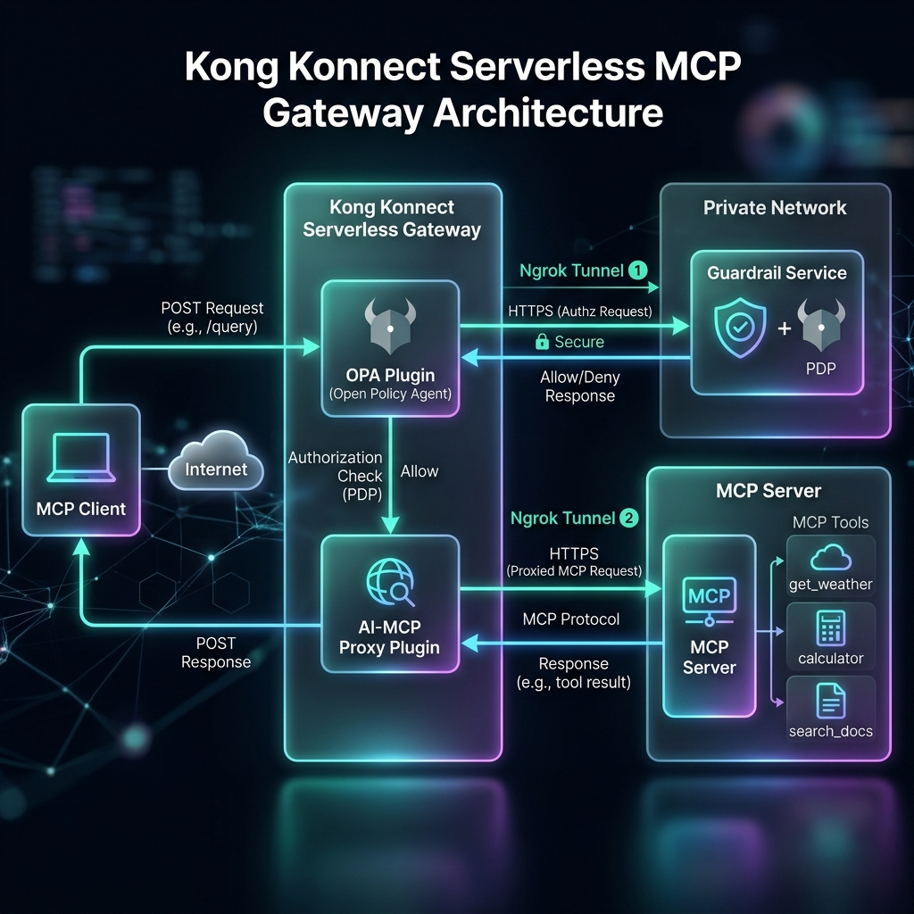
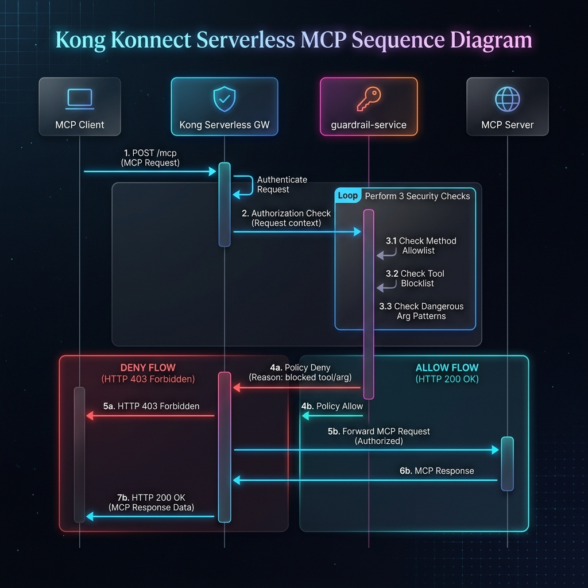

# Kong Konnect Serverless — MCP Gateway with Guardrail Service PDP

Front an upstream MCP server with **Kong Konnect Serverless** using the `ai-mcp-proxy` plugin (`passthrough-listener` mode) and enforce **tool-level access control** via the OPA plugin — calling the **guardrail-service** as the external PDP.

---

## Architecture



---

## Sequence Diagram



---

## What you host vs what Kong provides

| Component | Owner | Where it runs |
|---|---|---|
| Konnect Serverless Gateway | Kong (fully managed) | Kong cloud |
| `ai-mcp-proxy` plugin | Kong built-in | Kong data plane |
| OPA plugin | Kong built-in | Kong data plane — calls guardrail-service for every request |
| Route + plugin config (`kong-serverless.yaml`) | You | Pushed via `deck-push.sh` |
| Guardrail service (PDP) | **You** | Docker → exposed via ngrok |
| MCP server | **You** | Docker → exposed via ngrok |

---

## How OPA enforces policy

On every `POST /mcp`, Kong sends the full request body to the guardrail-service:

```
POST https://<guardrail-ngrok>/v1/data/mcp/authz/allow
{
  "input": {
    "request": {
      "http": {
        "parsed_body": {
          "method": "tools/call",           ← check 1: method allowlist
          "params": {
            "name": "get_weather",          ← check 2: tool blocklist
            "arguments": {"city": "Sydney"} ← check 3: dangerous argument scan
          }
        }
      }
    }
  }
}
```

All three checks must pass for `allow = true`. First failure returns `{"result": false}` → Kong 403.

| Check | Rule |
|---|---|
| Method allowlist | `initialize`, `ping`, `tools/call`, `tools/list`, `resources/list`, `resources/read`, `resources/templates/list`, `resources/subscribe`, `resources/unsubscribe`, `prompts/list`, `prompts/get`, `notifications/initialized`, `notifications/cancelled`, `notifications/progress`, `notifications/roots/list_changed`, `completion/complete`, `logging/setLevel`. GET requests (SSE channel setup) always allowed. |
| Tool blocklist | `execute_shell`, `run_command`, `eval_code`, `write_file`, `delete_file`, `drop_database`, `admin_reset` |
| Argument scan | Blocks `rm -rf`, `DROP TABLE`, `/etc/passwd`, `__import__`, `eval(`, `exec(` in any argument value |

See [`guardrail-service/main.py`](guardrail-service/main.py) (`mcp_authz` function) for the full policy.

---

## Prerequisites

> **Platform:** macOS (setup.sh uses Terminal.app for ngrok windows). Linux users can start ngrok manually — see [Manual setup](#manual-setup-alternative-to-setupsh).

| Requirement | Version | Notes |
|---|---|---|
| Docker + Docker Compose | Docker Desktop 4.x+ | https://www.docker.com/products/docker-desktop |
| ngrok | 3.x | `brew install ngrok/ngrok/ngrok` or https://ngrok.com/download |
| Konnect account | — | Serverless control plane + Personal Access Token |
| `deck` CLI | 1.38+ | `brew install kong/kong/deck` |
| `gettext` (for `envsubst`) | — | `brew install gettext && brew link --force gettext` |
| Python 3 | 3.9+ | `brew install python3` (used by setup.sh for URL parsing) |
| Kong AI Gateway license | — | Required for `ai-mcp-proxy` on Serverless |

---

## Quick Start

### 1. Run setup

```bash
./setup.sh          # first run — interactive prompts
./setup.sh --yes    # re-run — keeps all existing .env values, no prompts
```

This checks prerequisites, prompts for Konnect credentials and ngrok authtoken (skipping anything already in `.env`), starts Docker services, opens a single ngrok Terminal window with both tunnels, auto-detects tunnel URLs, writes `.env`, and optionally pushes config to Konnect.

### 2. Push config to Konnect

```bash
./deck-push.sh          # shows diff, prompts to confirm
./deck-push.sh diff     # dry-run only
./deck-push.sh ping     # verify credentials
```

### 3. Test

```bash
./test-serverless.sh local   # validate local services
./test-serverless.sh         # full E2E via Konnect
```

### 4. Explore with Insomnia

Import `insomnia-collection.json` into [Insomnia](https://insomnia.rest/) for a ready-to-use request collection covering all guardrail scenarios. Update the `kong_proxy` environment variable with your `KONNECT_PROXY_URL`.

### 5. Tear down

```bash
./cleanup.sh            # interactive — prompts before deleting .env
./cleanup.sh --yes      # keep .env, remove everything else
./cleanup.sh --purge    # remove everything including .env
```

---

## Manual setup (alternative to setup.sh)

**Start services:**
```bash
docker compose -f docker-compose-serverless.yml up --build -d
```

**Start ngrok tunnels** (single agent, both tunnels):
```bash
ngrok start --all --config ngrok-serverless.yml
```

**Fill in `.env`:**
```bash
cp .env.example .env
```
```ini
KONNECT_TOKEN=          # cloud.konghq.com → Account → Personal Access Tokens
KONNECT_CP_NAME=        # e.g. serverless-default
KONNECT_PROXY_URL=      # https://xxxx.us.serverless.konghq.com

MCP_SERVER_NGROK_URL=   # https://xxxx.ngrok-free.app  (port 8092)
GUARDRAIL_NGROK_HOST=   # xxxx.ngrok-free.app           (hostname only, port 8089)
```

---

## Services & Components

For detailed information on the individual services running in this demo, please refer to their respective documentation:

*   🛡️ [**Guardrail Service Documentation**](guardrail-service/README.md) - Explains the OPA policy checks, tool blocklisting, and argument scanning.
*   ⚙️ [**MCP Server Documentation**](mcp-server/README.md) - Details the available safe tools and the simulated dangerous tools used for testing.

---

## Project layout

```
├── guardrail-service/            # FastAPI PDP service (port 8089)
│   ├── README.md                 # Guardrail service documentation
│   ├── main.py                   # /v1/data/mcp/authz/allow — OPA-compatible MCP policy
│   ├── rules.py                  # LLM moderation rules (shared with main branch)
│   ├── requirements.txt
│   └── Dockerfile
├── mcp-server/                   # FastAPI JSON-RPC 2.0 MCP server (port 8092)
│   ├── README.md                 # MCP server documentation
│   ├── main.py                   # Tools: get_weather, calculator, search_docs, get_time
│   ├── requirements.txt
│   └── Dockerfile
├── docker-compose-serverless.yml # mcp-server (8092) + guardrail-service (8089)
├── kong-serverless.yaml          # decK config — MCP service + OPA plugin
├── deck-push.sh                  # envsubst + deck gateway sync (--select-tag mcp-demo)
├── ngrok-serverless.yml          # ngrok multi-tunnel config (both tunnels, one agent)
├── setup.sh                      # Interactive one-command setup (--yes for re-runs)
├── cleanup.sh                    # Tear down containers, images, and ngrok tunnels
├── test-serverless.sh            # Test suite: local + Konnect E2E
├── insomnia-collection.json      # Insomnia request collection for manual testing
└── .env.example
```

---

## Test scenarios

| Test | Method | Tool | Expected |
|---|---|---|---|
| A | `initialize` | — | 200 |
| B | `tools/list` | — | 200 |
| C | `tools/call` | `get_weather` | 200 |
| D | `tools/call` | `calculator` | 200 |
| E | `tools/call` | `search_docs` | 200 |
| F | `tools/call` | `execute_shell` | **403** — tool blocked |
| G | `tools/call` | `admin_reset` | **403** — tool blocked |
| H | `tools/call` | `write_file` | **403** — tool blocked |
| I | `tools/call` | `drop_database` | **403** — tool blocked |
| J | `unknown_xyz` | — | **403** — method not in allowlist |

---

## curl examples

**Safe tool:**
```bash
curl -s -X POST $KONNECT_PROXY_URL/mcp \
  -H "Content-Type: application/json" \
  -H "Accept: application/json, text/event-stream" \
  -d '{"jsonrpc":"2.0","id":1,"method":"tools/call","params":{"name":"get_weather","arguments":{"city":"Sydney"}}}' \
  | python3 -m json.tool
```

**Blocked tool (403):**
```bash
curl -s -X POST $KONNECT_PROXY_URL/mcp \
  -H "Content-Type: application/json" \
  -H "Accept: application/json, text/event-stream" \
  -d '{"jsonrpc":"2.0","id":1,"method":"tools/call","params":{"name":"execute_shell","arguments":{"cmd":"ls"}}}' \
  | python3 -m json.tool
```

**Test guardrail-service directly (no Kong):**
```bash
# allow — use same structure Kong OPA plugin sends
curl -s -X POST http://localhost:8089/v1/data/mcp/authz/allow \
  -H "Content-Type: application/json" \
  -d '{"input":{"request":{"http":{"parsed_body":{"method":"tools/call","params":{"name":"get_weather"}}}}}}'}

# deny
curl -s -X POST http://localhost:8089/v1/data/mcp/authz/allow \
  -H "Content-Type: application/json" \
  -d '{"input":{"request":{"http":{"parsed_body":{"method":"tools/call","params":{"name":"execute_shell"}}}}}}'
```

---

## Extending the policy

Edit [`guardrail-service/main.py`](guardrail-service/main.py) — add tool names to `_BLOCKED_TOOLS`, regex strings to `_DANGEROUS_ARG_PATTERNS`, or methods to `_ALLOWED_MCP_METHODS`. Then restart the service:

```bash
docker compose -f docker-compose-serverless.yml restart guardrail-service
```

No Kong config changes needed.

---

## Demo caveat — ngrok bypass

The MCP server's ngrok URL is publicly reachable. Any client that knows the URL can call the MCP server **directly**, bypassing Kong and OPA entirely. In this demo, the MCP server has a defence-in-depth guard (`if tool in dangerous: return error`) but it is **not** a substitute for the Kong/OPA layer.

For production, restrict the MCP server to accept traffic only from Kong (e.g., shared secret header, IP allowlist, or a private ngrok tunnel).

---

## PDP response format note

The Kong OPA plugin expects `{"result": true/false}` from the external PDP endpoint. The guardrail-service implements this contract directly at `/v1/data/mcp/authz/allow` — **no separate OPA server or Rego policy needed**.

If you have an existing PDP that returns a different format (e.g. `{"action": "deny"}`), you can adapt the endpoint in `guardrail-service/main.py` to call that PDP and translate its response.

---

## Why not pre-function?

| Approach | Konnect Serverless | Notes |
|---|---|---|
| `pre-function` + `resty.http` to external PDP | ✗ No | `resty.http` is sandboxed; `untrusted_lua_sandbox_requires` cannot be set on Serverless |
| `pre-function` inline (no HTTP) | Partial | Works for HTTP routes; no external PDP call possible |
| **`ai-mcp-proxy` + OPA** (this demo) | ✓ Yes | OPA makes the external call natively — no sandbox restriction |

`passthrough-listener` mode proxies **MCP streamable HTTP** (standard POST with chunked response). The body is buffered by Nginx so OPA and all access-phase plugins fire normally before `ai-mcp-proxy` forwards the request.

---

## Troubleshooting

**`deck-push.sh` fails with `envsubst: command not found`**
```bash
brew install gettext && brew link --force gettext
```

**ngrok tunnel URLs not detected automatically**
- Check `ngrok start --all --config ngrok-serverless.yml` is running in the Terminal window opened by `setup.sh`.
- Verify ngrok is authenticated: `ngrok config check`
- Paste URLs manually into `.env` and re-run `./deck-push.sh`.

**Kong returns 403 on all requests (including safe ones)**
- Confirm `GUARDRAIL_NGROK_HOST` in `.env` is the hostname only — no `https://` prefix, no trailing slash.
- Test the guardrail service directly: `curl http://localhost:8089/health`
- Check OPA plugin config in Konnect: Gateway Manager → your CP → Plugins.

**Kong returns 502/connection refused**
- The MCP server ngrok tunnel may have reset. Re-run ngrok and update `MCP_SERVER_NGROK_URL` in `.env`, then run `./deck-push.sh`.

**Docker health check stuck**
```bash
docker compose -f docker-compose-serverless.yml logs mcp-server
docker compose -f docker-compose-serverless.yml logs guardrail-service
```

**Test script reports all Konnect tests skipped**
- `KONNECT_PROXY_URL` is not set in `.env`. Run `./setup.sh` or set it manually.

---

## References

- [Kong OPA plugin](https://developer.konghq.com/plugins/opa/)
- [Kong ai-mcp-proxy plugin](https://developer.konghq.com/plugins/ai-mcp-proxy/)
- [OPA getting started](https://www.openpolicyagent.org/docs/latest/getting-started/)
- [MCP protocol spec](https://spec.modelcontextprotocol.io/)
- [Kong decK](https://docs.konghq.com/deck/)
- [Konnect Serverless](https://docs.konghq.com/konnect/gateway-manager/serverless-gateways/)
