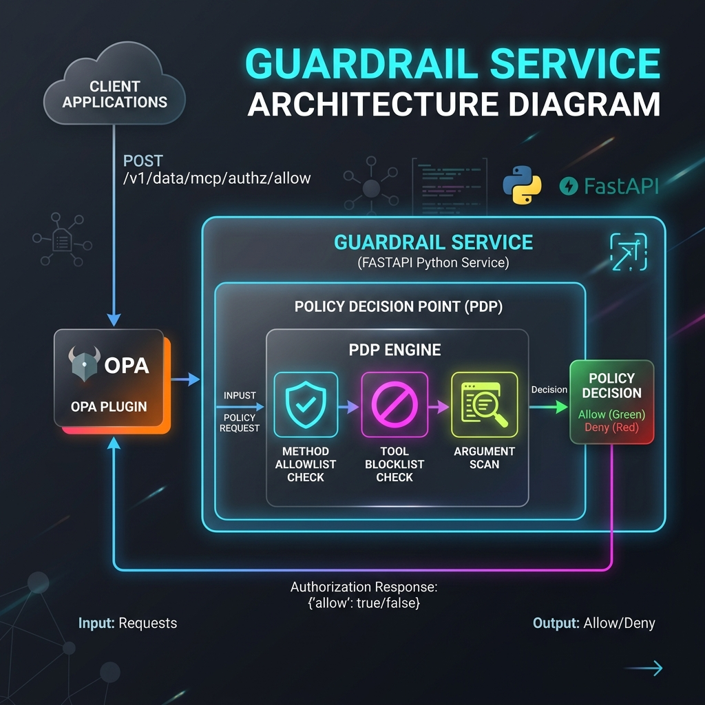

# Guardrail Service (Policy Decision Point)

The **Guardrail Service** acts as an external Policy Decision Point (PDP) for the Kong Konnect Serverless Gateway. It is a FastAPI Python application responsible for authorizing MCP (Model Context Protocol) tool calls in real-time.

## What It Contains

The service exposes two primary endpoints:

1.  **`/v1/data/mcp/authz/allow` (MCP Tool-Call Authorization)**
    This endpoint is fully compatible with the Kong OPA (Open Policy Agent) plugin. Kong sends every `POST /mcp` request here.
    The service performs three strict security checks before allowing a request:
    *   **Method Allowlist**: Ensures only safe lifecycle and tool execution methods are allowed (e.g., `initialize`, `tools/call`, `prompts/list`).
    *   **Tool Blocklist**: Explicitly denies execution of dangerous tools (e.g., `execute_shell`, `admin_reset`, `drop_database`).
    *   **Argument Pattern Scan**: Uses RegEx patterns to block dangerous shell arguments, SQL injections, and code execution (e.g., `rm -rf`, `eval()`).
    *   If all checks pass, it returns `{"result": true}`. Otherwise, it returns `{"result": false}` (which Kong translates into an HTTP 403 Forbidden).

2.  **`/moderate` (LLM Content Moderation)**
    This endpoint is used for content moderation of LLM prompts and responses (utilized by the `ai-custom-guardrail` plugin).

## Configuration

Policies and blocked tool definitions are managed directly inside [`main.py`](main.py). You can easily extend `_BLOCKED_TOOLS` or `_DANGEROUS_ARG_PATTERNS` to suit your production requirements.
