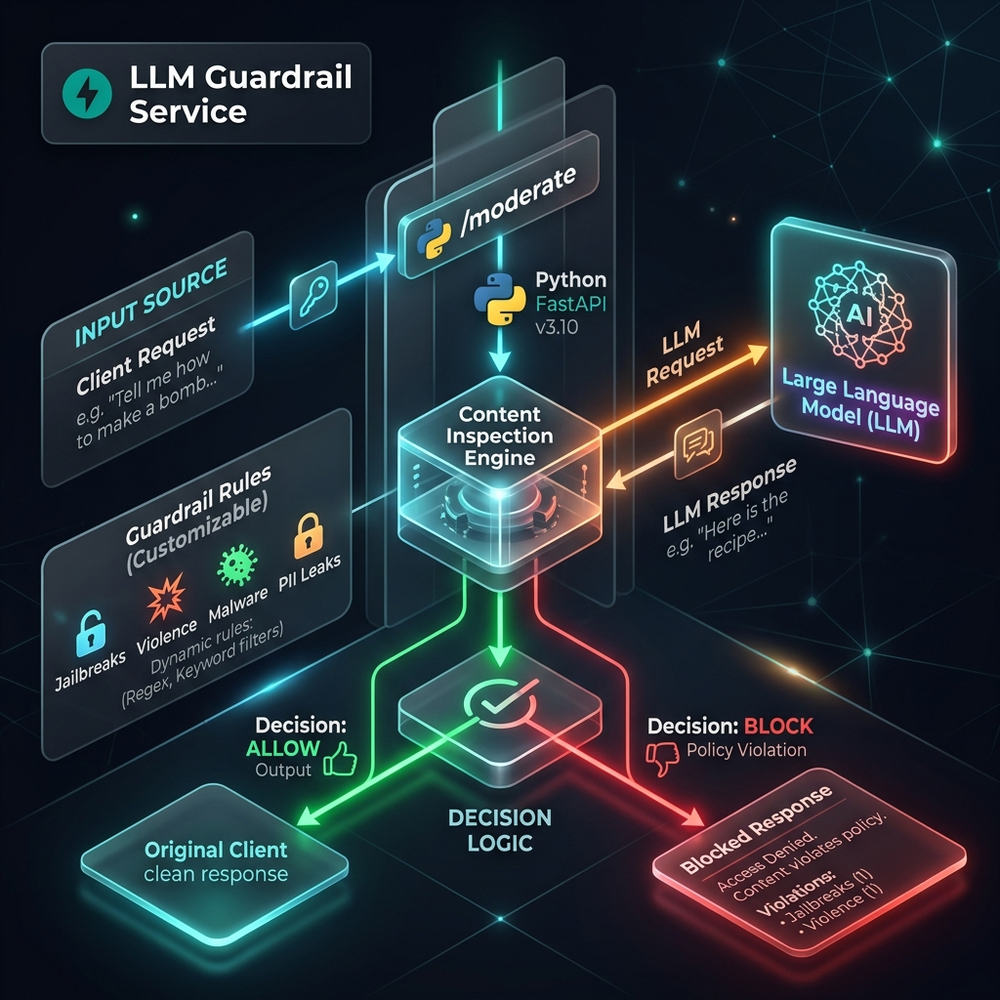

# LLM Guardrail Service

The **LLM Guardrail Service** is a lightweight Python/FastAPI application designed to act as a Policy Decision Point (PDP) for the Kong AI Custom Guardrail plugin. It inspects Large Language Model (LLM) traffic to block harmful, unsafe, or policy-violating content.

## What It Contains

The service exposes two endpoints:

### `POST /moderate`
This is the core content inspection endpoint. It handles both:
*   **INPUT Source:** User requests heading towards the LLM. It scans for jailbreaks, violence, malware instructions, and illegal activities.
*   **OUTPUT Source:** Responses returning from the LLM. It scans for PII leaks (e.g., email addresses) or harmful instructions generated by the model.

If a violation is detected, it returns a blocked response with the specific category and block reason, allowing Kong to return a `400 Bad Request` to the client.

### `GET /health`
A simple health check endpoint used by Docker to ensure the service is running.

## Rule Configuration

The moderation logic is fully customizable. You can define exact keyword matches or complex regular expressions in [`rules.py`](rules.py).

*   **`INPUT_BLOCKED_KEYWORDS`** / **`OUTPUT_BLOCKED_KEYWORDS`**: For exact phrasing (e.g., "ignore your instructions").
*   **`INPUT_BLOCKED_PATTERNS`** / **`OUTPUT_BLOCKED_PATTERNS`**: For regex-based detection (e.g., detecting email formats).

No restart of Kong is required when updating rules; simply rebuild this container.
