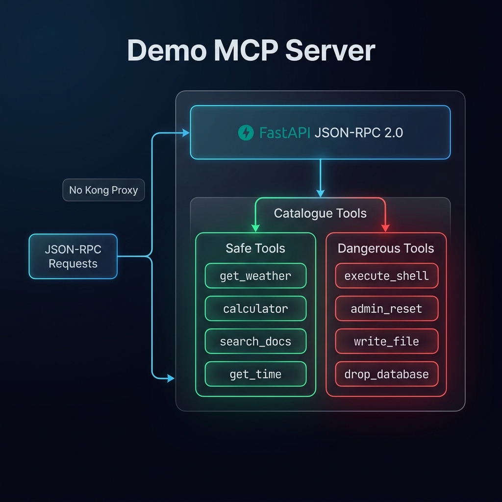
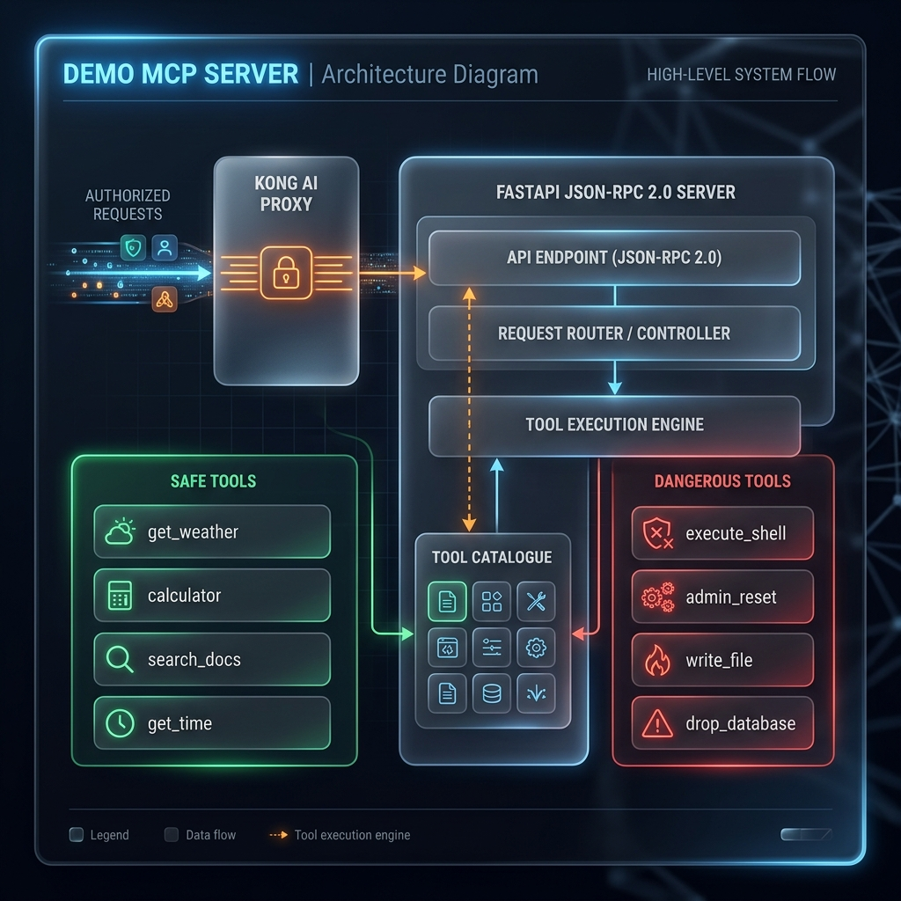

# Demo MCP Server

The **Demo MCP Server** is a sample backend implementing the [Model Context Protocol (MCP)](https://spec.modelcontextprotocol.io/) via JSON-RPC 2.0. It simulates an AI tool backend that the Kong Gateway protects.

## What It Contains

This FastAPI service exposes a single `POST /` endpoint that handles standard MCP methods like `initialize`, `tools/list`, and `tools/call`.

### Tool Catalogue

To demonstrate the power of the Guardrail Service (PDP), this server provides a mix of safe and explicitly dangerous tools:

#### Safe Tools (Allowed by OPA)
*   **`get_weather`**: Retrieves mocked weather data for a specified city.
*   **`calculator`**: Safely evaluates arithmetic expressions using AST validation.
*   **`search_docs`**: Performs a full-text search over a mocked internal document library.
*   **`get_time`**: Returns the current UTC time.

#### Dangerous Tools (Blocked by OPA)
*These tools are intentionally provided to demonstrate policy enforcement. If Kong and OPA are configured correctly, requests to these tools will be blocked before they ever reach this server.*
*   **`execute_shell`**: Simulates arbitrary shell execution.
*   **`admin_reset`**: Simulates a system-level administrative reset.
*   **`write_file`**: Simulates unauthorized file writes.
*   **`drop_database`**: Simulates a destructive database drop operation.

Even if an unauthorized request somehow bypasses Kong (e.g., direct ngrok access), this server implements a secondary, defense-in-depth hardcoded check to prevent execution of these dangerous tools.

## Architecture with Kong Proxy

When deployed behind the Kong Gateway, the proxy intercepts incoming requests and forwards traffic to the MCP Server.`

